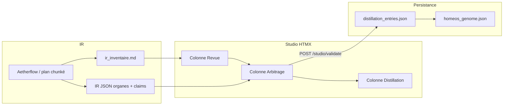

# Plan pour y voir clair — IR → Arbitrage → Genome

## 1. Vision et documents de référence

| Document                                                                | Rôle                                                                                              |
| ----------------------------------------------------------------------- | ------------------------------------------------------------------------------------------------- |
| [FRONTEND AGENCY-LIKE.md](docs/05-operations/FRONTEND%20AGENCY-LIKE.md) | Organisation technique : IR = JSON pur, Jinja atomique, DX = `/studio/validate` + genome.         |
| [Roadmap_ARBITRAGE_GPT.md](docs/05-operations/Roadmap_ARBITRAGE_GPT.md) | Méthode méta : pipeline Extractor → Scorer → Bayes (déterministe) → Renderer ; LLM ne décide pas. |
| [Méthode d'arbitrage.md](docs/02-sullivan/Méthode%20d'arbtrage.md)      | Contrat produit : Corps/Organes/Atomes, ton Sullivan, principes bayésiens en langage naturel.     |

Contrat technique déjà en place :

- [ir_schema.json](docs/references/technique/ir_schema.json) — Schéma du JSON IR (Organe = section, N claims = cases à cocher, verdict par Organe).
- [SPEC_IR_ORGANES_CLAIMS.md](docs/05-operations/SPEC_IR_ORGANES_CLAIMS.md) — Flux IR → Arbitrage → Genome, format distillation, rétrocompat "Garder" = Accept.

---

## 2. Flux de données (vue d’ensemble)

- **IR** : Aetherflow produit aujourd’hui `ir_inventaire.md` ; la cible est aussi (ou à la place) un **IR JSON** conforme à `ir_schema.json`.
- **Revue** : affiche l’inventaire (Markdown ou rendu depuis IR JSON).
- **Arbitrage** : un formulaire par **Organe** (id, title), N **claims** en cases à cocher, verdict **Accept / Revise / Reject** par Organe.
- **Distillation** : chaque validation enregistre `section_id`, `section_title`, `items` (claims cochés), `verdict`.
- **Genome** : alimenté par les entrées distillation (spec à préciser : quels champs, quand).

---

## 3. État actuel

| Élément                                                        | Statut                                                                           |
| -------------------------------------------------------------- | -------------------------------------------------------------------------------- |
| Schéma IR (organes, claims, verdict)                           | Fait — [ir_schema.json](docs/references/technique/ir_schema.json)                |
| Spec flux + format distillation                                | Fait — [SPEC_IR_ORGANES_CLAIMS.md](docs/05-operations/SPEC_IR_ORGANES_CLAIMS.md) |
| Studio : colonne Revue (IR en Markdown)                        | Fait — GET `/studio/reports/ir`                                                  |
| Studio : formulaires arbitrage (Topologie, Endpoints, Clés IR) | Fait — HTML statique dans [studio.html](Backend/Prod/templates/studio.html)      |
| Studio : verdict par Organe                                    | Partiel — un seul verdict "Garder" (à étendre en Accept / Revise / Reject)       |
| Studio : formulaires générés depuis IR JSON                    | À faire — aujourd’hui formulaires en dur                                         |
| Génération IR JSON par Aetherflow                              | À faire — aujourd’hui seul `ir_inventaire.md`                                    |
| Pipeline Roadmap (Extractor, Scorer, Bayes, Renderer)          | À faire — décrit dans Roadmap, pas implémenté                                    |
| Mise à jour genome depuis distillation                         | À préciser — format et déclencheur                                               |

---

## 4. Phases proposées (pour y voir clair et avancer)

**Phase 1 — Aligner Studio sur le contrat (court terme)**  

- Ajouter dans l’UI le choix **Accept / Revise / Reject** par Organe (au lieu d’un seul "Garder").  
- Accepter et persister `verdict` = Accept | Revise | Reject dans [api.py](Backend/Prod/api.py) (POST `/studio/validate`) et afficher en Distillation ; garder "Garder" en lecture comme Accept.  
- Optionnel : introduire un endpoint type GET `/studio/ir.json` qui retourne un IR JSON (ex. dérivé de `ir_inventaire.md` ou d’un fichier dédié) pour préparer la génération dynamique.

**Phase 2 — Générer les formulaires depuis IR JSON**  

- Charger l’IR JSON (fichier ou endpoint), valider avec `ir_schema.json` (ou modèle Pydantic équivalent).  
- Remplacer les formulaires statiques de la colonne Arbitrage par un rendu **Jinja** : une boucle sur `organes`, pour chaque organe N checkboxes (claims) + sélecteur verdict (Accept / Revise / Reject).  
- Conserver le comportement actuel de POST `/studio/validate` (section_id, section_title, items, verdict).

**Phase 3 — Produire l’IR en JSON (côté Aetherflow)**  

- Adapter le plan chunké IR (ou un nouveau plan) pour que la sortie soit un **IR JSON** conforme à `ir_schema.json` (organes + claims) en plus ou à la place du Markdown.  
- Alimenter Studio avec ce JSON (fichier `output/studio/ir_inventaire.json` ou équivalent) pour que Revue et Arbitrage s’appuient sur la même source.

**Phase 4 — Pipeline Arbitrage (Roadmap) et Genome (plus tard)**  

- Implémenter le pipeline décrit dans [Roadmap_ARBITRAGE_GPT.md](docs/05-operations/Roadmap_ARBITRAGE_GPT.md) : extraction de claims depuis PRD/IR, scoring, Bayes déterministe, Renderer (style Méthode d’arbitrage).  
- Définir et implémenter la **mise à jour du genome** à partir des entrées distillation (quels champs, quel événement — ex. après validation ou batch).

---

## 5. Ordre recommandé

1. **Phase 1** — Verdict Accept/Revise/Reject + rétrocompat "Garder" : impact limité (API + template Studio), donne tout de suite la sémantique complète par Organe.
2. **Phase 2** — Formulaires depuis IR JSON : rend le Studio indépendant du HTML en dur et aligné sur le schéma.
3. **Phase 3** — Production IR JSON par Aetherflow : boucle la boucle "IR → Revue → Arbitrage" sur le contrat.
4. **Phase 4** — Pipeline + genome : après stabilisation de l’usage Studio et du format distillation.

Ce plan peut servir de trame pour un document "Plan IR Arbitrage Genome" (une page) à placer dans [docs/05-operations](docs/05-operations) ou [docs/notes](docs/notes) pour garder la vision et les prochaines étapes au même endroit.