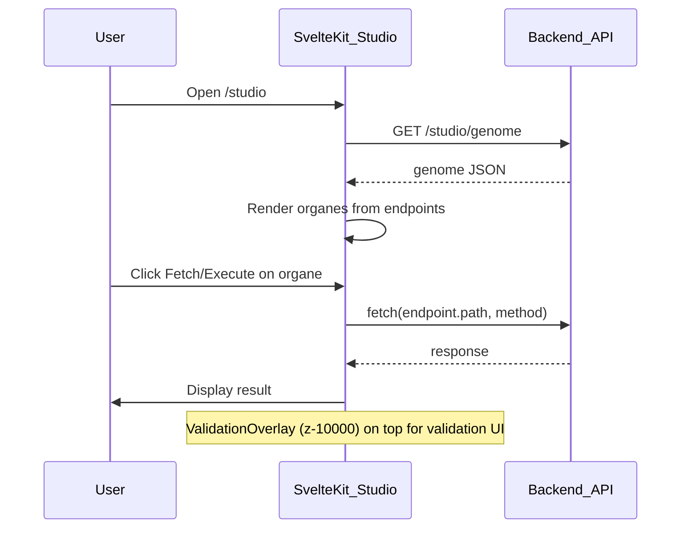

# Plan : Phases A, B, C (ordre alphabétique)

## Contexte

- Le meta plan [PLAN_MODE_MANAGER.md](docs/04-homeos/PLAN_MODE_MANAGER.md) est terminé (5 étapes).
- L’API expose déjà `GET /studio/genome` ([Backend/Prod/api.py](Backend/Prod/api.py) ~L351) et `GET /files/homeos_genome.json`.
- [Frontend/studio.html](Frontend/studio.html) + [Frontend/js/studio-genome.js](Frontend/js/studio-genome.js) font déjà le chargement du genome et le rendu des organes en vanilla.
- [frontend-svelte](frontend-svelte/) est une app SvelteKit avec une page Designer (upload) ; pas encore de page “Studio genome” ni d’overlay Validation UI.

---

## Phase Apply — Tests unitaires (à la suite de la phase menée)

Série de tests unitaires couvrant la phase « revert heuristiques + séparation structure/code en deux fichiers » (apply renforcé).

- **Fichier** : [Backend/Prod/tests/test_apply_phase.py](Backend/Prod/tests/test_apply_phase.py)
- **Couverture** :
  - **split_structure_and_code** : input vide, pas de structure, bloc `file_tree`, bloc `structure`, lignes arborescence (├──, │, └──), une seule ligne arborescence ignorée.
  - **get_step_output** : préférence `step_X_code.txt` quand présent, fallback `step_X.txt`, `None` si absent.
  - **_save_step_outputs** (via Orchestrator) : écriture de `step_X_code.txt`, `step_X_structure.md` si structure détectée, `step_X.txt` ; vérification que `get_step_output` renvoie bien le contenu code.

**Lancer les tests** (depuis la racine, venv activé) :

```bash
python -m pytest Backend/Prod/tests/test_apply_phase.py -v
```

---

## Phase A — Consolidation et documentation

### A1. État des lieux

- **Objectif** : Un document unique qui liste ce qui est en place après le meta plan et après la phase B.
- **Fichier** : [docs/04-homeos/ETAT_LIEUX.md](docs/04-homeos/ETAT_LIEUX.md) (nouveau).
- **Contenu (structure proposée)** :
  - Meta plan : 5 étapes (couche méta, deux modes, CLI, IR, construction bottom-up) — fait.
  - Package `homeos/` : core (mode_manager), construction, project, config, ir (pipeline + arbiter), cli.
  - CLI : `homeos mode`, `homeos switch --construction|--project`.
  - API : `GET /studio/genome`, routes Sullivan, etc.
  - Frontend : Frontend/ (vanilla) — index, studio.html + studio-genome.js ; frontend-svelte (SvelteKit) — Designer upload, page Studio genome, overlay Sullivan Validation UI.
  - Test responsive : homeos/construction/tests/responsive_test.py (mode construction).
  - Références : PLAN_MODE_MANAGER, MANIFESTE_HOMEOS_V0, design_tokens, SULLIVAN_VALIDATION_UI.

### A2. README homeos

- **Objectif** : Point d’entrée clair pour HomeOS : où est le plan, quoi lancer, quoi lire.
- **Fichiers** :
  - Mettre à jour [docs/04-homeos/README.md](docs/04-homeos/README.md) : ajouter un court paragraphe “État des lieux” avec lien vers `ETAT_LIEUX.md`, et garder les liens existants (PRD, plan genome frontend, etc.).
  - Optionnel : ajouter `homeos/README.md` (court) : rôle du package (modes construction/project, CLI `homeos`, usage typique : `homeos mode`, `homeos switch --construction`), sans détailler tout le code.

---

## Phase B — Studio concret

### B1. SvelteKit : page Studio genome

- **Objectif** : Une route SvelteKit (ex. `/studio` ou `/studio/genome`) qui charge le genome via l’API et affiche les organes dynamiquement (comme [plan_genome_frontend_self_construction.md](docs/04-homeos/plan_genome_frontend_self_construction.md) Partie 2).
- **Fichiers** :
  - Nouvelle route dans `frontend-svelte/src/routes/` (ex. `studio/+page.svelte` ou `studio/genome/+page.svelte`).
  - Appel à `GET /studio/genome` (base URL de l’API configurable : env `VITE_API_BASE` ou équivalent).
  - Pour chaque endpoint du genome : bloc UI (bouton Fetch/Execute, zone réponse) selon `x_ui_hint` (form, status, terminal, etc.). S’inspirer de la logique de [Frontend/js/studio-genome.js](Frontend/js/studio-genome.js) (renderOrgane, substitutePathParams, defaultPostBody).
- **Livrable** : En mode construction, ouvrir le front SvelteKit sur `/studio` (ou `/studio/genome`) affiche les organes générés à partir du genome.

### B2. Sullivan Validation UI (overlay)

- **Objectif** : Couche overlay “Sullivan Validation” (z-index 10000) pour afficher résultats de validation et actions (accept / reject / refine), conforme à [SULLIVAN_VALIDATION_UI.md](docs/04-homeos/SULLIVAN_VALIDATION_UI.md).
- **Fichiers** :
  - Composant Svelte overlay dans `frontend-svelte/src/` (ex. `lib/components/ValidationOverlay.svelte`) : position fixed, z-index 10000, contenu minimal (titre “Sullivan Validation”, zone message, boutons Accept / Reject / Refine stub).
  - L’intégrer dans le layout Studio (ex. layout qui enveloppe `/studio` ou layout global) pour qu’il soit visible en mode construction ; au début on peut le rendre visible via un flag (ex. query `?validation=1`) ou toujours affiché en dev.
- **Doc** : Nettoyer [docs/04-homeos/SULLIVAN_VALIDATION_UI.md](docs/04-homeos/SULLIVAN_VALIDATION_UI.md) : supprimer le bloc de code Python en fin de fichier (à partir de `class AgentRouter:`), garder uniquement la spec (Purpose, Z-index, Integration, Reference).

### B3. Câblage API et config

- **Objectif** : Le front SvelteKit appelle l’API Backend (genome, Sullivan) sans souci CORS ; base URL configurable.
- **Fichiers** :
  - Vérifier / ajouter dans `frontend-svelte` une config d’URL API (ex. `VITE_API_BASE` dans `.env.example` et usage dans `$lib/api` ou équivalent).
  - S’assurer que les appels vers `GET /studio/genome` et les routes Sullivan utilisent cette base (déjà le cas si tout passe par la même origin ou proxy ; sinon adapter les appels fetch).
- **Pour que /studio affiche les organes (éviter 404)** : lancer **les deux** — 1) API Backend : `./start_api.sh` (port 8000) ; 2) Frontend SvelteKit : `cd frontend-svelte && npm run dev` (port 5173). En dev, le proxy Vite envoie `/api/*` vers `http://127.0.0.1:8000`, donc les appels à `GET /studio/genome` passent par `/api/studio/genome` et sont proxifiés. Si l’API n’est pas lancée, la page /studio charge mais l’appel genome échoue (erreur réseau ou 502).

### B4. Implémenter le test responsive design

- **Objectif** : Test automatisé pour le mode construction qui vérifie unités relatives, media queries, et optionnellement screenshots à différentes résolutions (réf. [homeos-core-mode_manager.py.md](docs/04-homeos/homeos-core-mode_manager.py.md) section 6 et validation_rules `must_pass_responsive_test` dans [construction_config.yaml](homeos/config/construction_config.yaml)).
- **Fichiers** :
  - Créer `homeos/construction/tests/responsive_test.py` avec une classe `ResponsiveDesignTest` : méthode `test_component(component_path: Path)` qui lit le contenu (Svelte/CSS), vérifie les unités (interdites : px, pt, pc, in, cm, mm ; autorisées : %, rem, em, vw, vh, ch, ex), la présence de `@media`, et l’usage de `display: flex` ou `display: grid` ; retourne un dict `passed`, `score`, `issues`, `warnings`. S’inspirer du stub dans homeos-core-mode_manager.py.md (lignes 336–406).
  - Optionnel : ajouter un script ou point d’entrée pour lancer le test sur un répertoire de composants (ex. `frontend-svelte/src/**/*.svelte`).
- **Livrable** : Exécution du test sur un composant Svelte donne un résultat passed/failed et une liste d’issues/warnings.

---

## Phase C — HCI Intent Refactoring

**Référence** : [docs/02-sullivan/HCI DE L'INTENT REFACTORING.md](docs/02-sullivan/HCI%20DE%20L'INTENT%20REFACTORING.md)

### Objectif

Implémenter l’interface humaine de l’Intent Refactoring (IR) : rendre visible l’écart entre intention déclarée et implémentation, avec 3 panels (Intentions / Implémentation / Actions), 7 phases visuelles, et communication temps réel avec le backend Aetherflow.

### C1. Architecture visuelle

- **Layout 3 panels** : Panel 1 = Intentions (Manifeste), Panel 2 = Implémentation (code existant), Panel 3 = Actions (décisions). Header avec IR Progress, Current Phase, Validation Status.
- **Z-index** : overlay IR 10000, phase indicator 10001, highlight 9999, tooltip 10002 (cf. doc §2.2).

### C2. Sept phases visuelles (vues)

1. Inventaire fonctionnel — stats, nuage de points (couverture / complexité / statut).
2. Mapping Intention ↔ Features — objectif + features associées, diagramme Venn.
3. Détection zones floues — ambiguïtés, hypothèse système, options Garder/Réserve/Obsolète.
4. Explication pédagogique — pourquoi une feature existe, aperçu composant, métriques.
5. Dialogue de décision — lot de features en attente, radio Garder/Réserve/Obsolète, valider lot.
6. Compartimentation — CORE / SUPPORT / RESERVE / DEPRECATED, sunburst.
7. Gel du génome — checklist, artefacts (genome_v1.json, intent_feature_map.csv, audit_report.md), bouton « Geler ».

### C3. Composants et structure (Svelte)

- **Structure** (alignée sur doc § « Implementation technique ») : ex. `frontend-svelte/src/lib/ir_interface/` ou `sullivan/ir_interface/` avec :
  - **components/** : PhaseIndicator, IntentCard (Intent Matrix), FeatureMatrix, AmbiguityScanner, DecisionPanel, GenomeVisualizer.
  - **stores/** : irState.store.js, decisions.store.js, validation.store.js.
  - **services/** : aetherflowIR.service.js (appels API IR), realtimeUpdates.service.js (WebSocket), persistence.service.js (session, autosave).
  - **views/** : une vue par phase (InventoryPhase, MappingPhase, AmbiguityPhase, etc.) ou équivalent.

### C4. Communication backend

- **WebSocket** : `ws://<API_BASE>/ir-updates` pour `inventory_update`, `ambiguity_found`, `decision_validated` (doc § « Communication avec Aetherflow »). Adapter l’URL via config (ex. VITE_API_BASE).
- **API REST** : endpoints IR existants ou à prévoir côté Backend pour inventaire, mapping, décisions, gel (à recenser dans ETAT_LIEUX ou doc API).

### C5. Intégration Studio

- L’IR s’affiche dans le Studio comme **overlay** (même principe que B2 Sullivan Validation UI) : ex. `SullivanOverlay` ou `IntentRefactoringUI` avec z-index 10000, intégré à la route `/studio` ou dédiée `/studio/ir`.
- État persistant : session IR (phase, progress, decisions_made, pending_decisions, last_saved, autosave) — format doc §8.3.

### C6. Règles HCI et livrables

- Respect des règles doc §9 (une décision à la fois, feedback immédiat, pas de perte de données, undo, guidance, transparence, souveraineté humaine, < 3s sans feedback, consistance).
- Checklist de validation HCI (doc en fin) : phases 1–7 compréhensibles, navigation fluide, autosave, accessibilité WCAG AA.

**Ordre suggéré Phase C** : C1 (layout + z-index) → C3 stores/services → C2 vues par phase (1→7) → C4 WebSocket + API → C5 intégration overlay Studio → C6 validation et accessibilité.

---

## Ordre d’exécution (séquentiel)

1. **Tests Apply** — Lancer la série de tests unitaires de la phase apply : `python -m pytest Backend/Prod/tests/test_apply_phase.py -v`.
2. **Phase B -f** — Exécuter la Phase B (Studio concret) via Aetherflow full PROD : créer ou réutiliser un plan JSON pour B1→B2→B3→B4, puis lancer `./run_aetherflow.sh -f --plan <plan_phase_b>.json --output <dir>`.
3. **B1** — Page Studio genome dans SvelteKit.
4. **B2** — Composant ValidationOverlay + nettoyage SULLIVAN_VALIDATION_UI.md.
5. **B3** — Config API (base URL) et CORS si besoin.
6. **B4** — Implémenter le test responsive design (homeos/construction/tests/responsive_test.py).
7. **A1** — Rédaction ETAT_LIEUX.md.
8. **A2** — Mise à jour docs/04-homeos/README.md (+ optionnel homeos/README.md).
9. **C** — HCI Intent Refactoring (voir section Phase C ci-dessus).

---

## Schéma (flux Phase B)




