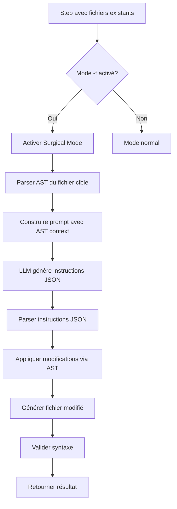

# Plan d'implémentation : Mode "Surgical Edit" pour AETHERFLOW

## Problème actuel

Même avec l'injection des fichiers existants, les LLMs (Groq/DeepSeek) génèrent du code qui "ressemble" à l'existant mais ne s'intègre pas parfaitement :

- Structure modifiée : LLM réinvente les classes
- Imports cassés : LLM ne connaît pas l'arbre d'imports
- Incohérence de nommage : LLM invente des noms
- Merge manuel requis : Output = fichier complet au lieu d'instructions précises

## Solution : Mode "Surgical Edit"

Au lieu de générer un fichier complet, le LLM génère des instructions de modification structurées (JSON) qui sont ensuite appliquées automatiquement via AST.

## Architecture




## Composants à créer/modifier

### 1. Nouveau module : `Backend/Prod/core/surgical_editor.py`

**Responsabilités** :

- Parser l'AST d'un fichier Python
- Générer un contexte AST structuré pour le prompt
- Parser les instructions JSON du LLM
- Appliquer les modifications via AST
- Valider la syntaxe du résultat

**Classes principales** :

- `ASTParser` : Parse un fichier Python en AST et extrait la structure
- `SurgicalInstructionParser` : Parse les instructions JSON du LLM
- `SurgicalApplier` : Applique les modifications à l'AST et régénère le code

**Format des instructions JSON** :

```json
{
  "operations": [
    {
      "type": "add_method",
      "target": "Component",
      "position": "after",
      "after_method": "existing_method",
      "code": "def new_method(self): ..."
    },
    {
      "type": "replace_import",
      "old": "from typing import List",
      "new": "from typing import List, Dict"
    },
    {
      "type": "add_import",
      "import": "from pathlib import Path"
    },
    {
      "type": "modify_method",
      "target": "Component.process",
      "modifications": [
        {"type": "add_parameter", "name": "new_param", "default": "None"},
        {"type": "add_line", "after_line": 10, "code": "logger.info('New line')"}
      ]
    }
  ]
}
```

### 2. Modification : `Backend/Prod/orchestrator.py`

**Changements** :

- Détecter automatiquement le mode surgical : `-f` activé ET fichiers existants dans `step.context.files`
- Intégrer `SurgicalEditor` dans `_execute_step()`
- Modifier le prompt pour demander des instructions JSON au lieu d'un fichier complet

**Méthodes à modifier** :

- `_execute_step()` : Détecter mode surgical et utiliser `SurgicalEditor`
- `_load_existing_files()` : Déjà existante, à réutiliser

### 3. Modification : `Backend/Prod/models/agent_router.py`

**Changements** :

- Modifier `_build_prompt()` pour inclure le contexte AST quand le mode surgical est activé
- Ajouter des instructions spécifiques pour générer des instructions JSON structurées

**Nouveau format de prompt** :

```
Task: [description]

Existing code files:
=== File: path/to/file.py ===
[code content]

AST Structure:
- Class Component (line 10-50)
 - Method existing_method (line 15-25)
 - Method other_method (line 27-35)
- Imports (line 1-8)

SURGICAL MODE: Instead of generating the complete file, generate structured JSON instructions:
{
  "operations": [
    {
      "type": "add_method",
      "target": "Component",
      "position": "after",
      "after_method": "existing_method",
      "code": "..."
    }
  ]
}

Requirements:
- [validation criteria]
```

### 4. Modification : `Backend/Prod/claude_helper.py`

**Changements** :

- Modifier `apply_generated_code()` pour détecter et traiter les instructions JSON
- Intégrer `SurgicalEditor` pour appliquer les modifications

**Logique** :

```python
def apply_generated_code(...):
    # Détecter si output contient des instructions JSON
    if is_surgical_instructions(step_output):
        surgical_editor = SurgicalEditor(target_file)
        return surgical_editor.apply_instructions(step_output)
    else:
        # Mode normal (fichier complet)
        ...
```

### 5. Nouveau module : `Backend/Prod/core/ast_utils.py` (optionnel, helpers)

**Utilitaires AST** :

- Fonctions helper pour naviguer/modifier l'AST
- Conversion AST ↔ code source
- Validation de syntaxe

## Détails d'implémentation

### Format des instructions JSON (détaillé)

**Opérations supportées** :

1. **add_method** : Ajouter une méthode à une classe
  ```json
   {
     "type": "add_method",
     "target": "ClassName",
     "position": "after|before|end",
     "after_method": "method_name",  // si position=after
     "code": "def new_method(self): ..."
   }
  ```
2. **modify_method** : Modifier une méthode existante
  ```json
   {
     "type": "modify_method",
     "target": "ClassName.method_name",
     "modifications": [
       {"type": "add_parameter", "name": "param", "default": "None"},
       {"type": "add_line", "after_line": 5, "code": "..."},
       {"type": "replace_line", "line": 10, "code": "..."}
     ]
   }
  ```
3. **add_import** : Ajouter un import
  ```json
   {
     "type": "add_import",
     "import": "from module import Class"
   }
  ```
4. **replace_import** : Remplacer un import
  ```json
   {
     "type": "replace_import",
     "old": "from typing import List",
     "new": "from typing import List, Dict"
   }
  ```
5. **add_class** : Ajouter une classe
  ```json
   {
     "type": "add_class",
     "position": "after|before|end",
     "after_class": "ClassName",  // si position=after
     "code": "class NewClass: ..."
   }
  ```
6. **add_function** : Ajouter une fonction au niveau module
  ```json
   {
     "type": "add_function",
     "position": "after|before|end",
     "after_function": "function_name",
     "code": "def new_function(): ..."
   }
  ```

### Gestion des erreurs

- Si le LLM génère un fichier complet au lieu d'instructions JSON → Fallback vers mode normal avec warning
- Si les instructions JSON sont invalides → Erreur claire avec suggestion de correction
- Si l'application AST échoue → Rollback et fallback vers mode normal
- Validation de syntaxe après application → Vérifier que le code généré est valide

### Limitations initiales

- **Python uniquement** : Support Python d'abord, extension à JS/TS plus tard
- **Modifications simples** : Focus sur add/modify methods, imports, classes
- **Pas de refactoring complexe** : Renommage, déplacement de code = mode normal

## Tests

1. **Tests unitaires** :
  - `test_ast_parser.py` : Vérifier parsing AST
    - `test_surgical_instructions.py` : Vérifier parsing instructions JSON
    - `test_surgical_applier.py` : Vérifier application des modifications
2. **Tests d'intégration** :
  - Test avec un plan réel utilisant `-f` et fichiers existants
    - Vérifier que les modifications sont appliquées correctement
    - Vérifier que les imports sont préservés

## Dépendances

- `ast` : Déjà disponible (built-in Python)
- `astunparse` ou `astor` : Pour convertir AST → code (à ajouter à requirements.txt)
- `libcst` : Optionnel, pour modifications plus avancées (à évaluer)

## Ordre d'implémentation

1. Créer `surgical_editor.py` avec classes de base
2. Implémenter `ASTParser` pour extraire la structure
3. Implémenter `SurgicalInstructionParser` pour parser le JSON
4. Implémenter `SurgicalApplier` pour appliquer les modifications
5. Modifier `orchestrator.py` pour détecter et utiliser le mode surgical
6. Modifier `agent_router.py` pour adapter le prompt
7. Modifier `claude_helper.py` pour intégrer dans `apply_generated_code()`
8. Tests et validation
9. Documentation

## Fichiers à créer/modifier

**Nouveaux fichiers** :

- `Backend/Prod/core/surgical_editor.py`
- `Backend/Prod/core/ast_utils.py` (optionnel)
- `Backend/Prod/tests/test_surgical_editor.py`

**Fichiers à modifier** :

- `Backend/Prod/orchestrator.py` : Détection mode surgical, intégration
- `Backend/Prod/models/agent_router.py` : Adaptation prompt
- `Backend/Prod/claude_helper.py` : Intégration dans `apply_generated_code()`
- `requirements.txt` : Ajouter `astunparse` ou `astor`

