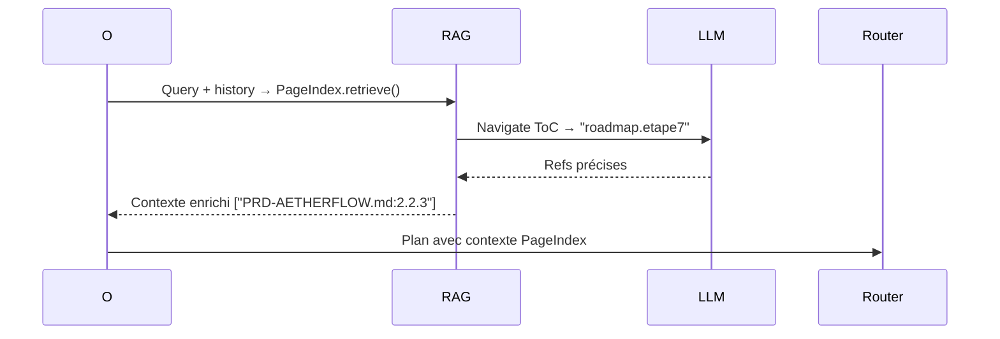

PageIndex remplace avantageusement le RAG vectoriel actuel (ChromaDB) d'AetherFlow par un index hiérarchique raisonné, idéal pour vos docs structurés (PRD, roadmap) et future codebase. [ppl-ai-file-upload.s3.amazonaws](https://ppl-ai-file-upload.s3.amazonaws.com/web/direct-files/attachments/56387897/e8154e9c-1651-41c1-8200-ca5309e6a030/PLAN_GENERAL_ROADMAP.md)

## Principe d'intégration
Remplacez l'indexation vectorielle statique par une arborescence dynamique : un LLM (ex. Mistral Small, low-cost) parcourt récursivement les fichiers MD/code comme une table des matières (ToC inférée), identifie sections pertinentes ("Étape 7 parallélisation dans PLAN_GENERAL_ROADMAP.md > Section Étape 7"), et retrieve chunks cohérents avec refs précises (node_id: "roadmap.etape7"). Intégrez au workflow Orchestrator : contexte enrichi pour planification/synthèse sans embeddings coûteux. Avantages : traçabilité ("voir PRD 2.2.3"), zero vector DB, CPU-only, parfait pour Phase 3 roadmap. [ppl-ai-file-upload.s3.amazonaws](https://ppl-ai-file-upload.s3.amazonaws.com/web/direct-files/attachments/56387897/88c62a43-5a2c-40a5-aa9e-79ea1abe0fd0/PRD-AETHERFLOW.md)

## Modifications roadmap (Étape 8 upgradée)
- **Phase 2 fin** : Ajoutez PageIndex comme pré-Étape 8 (priorité haute post-parallélisation).
- **Fichiers impactés** : `Backend/Prod/rag/` (remplace ChromaDB) + hook dans `orchestrator.py` (process_request). [ppl-ai-file-upload.s3.amazonaws](https://ppl-ai-file-upload.s3.amazonaws.com/web/direct-files/attachments/56387897/e8154e9c-1651-41c1-8200-ca5309e6a030/PLAN_GENERAL_ROADMAP.md)
- **Métriques ajoutées** : rag_efficiency > cache_hit_rate (actuel), + précision refs (target 95%). [ppl-ai-file-upload.s3.amazonaws](https://ppl-ai-file-upload.s3.amazonaws.com/web/direct-files/attachments/56387897/88c62a43-5a2c-40a5-aa9e-79ea1abe0fd0/PRD-AETHERFLOW.md)

## Implémentation détaillée (LlamaIndex)
```python
# Nouveau: Backend/Prod/rag/pageindex_store.py
from llama_index.core import SimpleDirectoryReader, PageIndexPlanner
from llama_index.llms.llama_parse import LlamaParseParser  # Ou Mistral via AgentRouter

class PageIndexRAG:
    def __init__(self, docs_path: str = "Backend/Prod/docs"):  # PRD/ROADMAP
        self.reader = SimpleDirectoryReader(input_dir=docs_path, required_exts=[".md", ".py"])
        self.nodes = self.reader.load_data()
        self.planner = PageIndexPlanner.from_documents(self.nodes)  # Arborescence auto
    
    async def retrieve(self, query: str, history: list) -> list:
        # Raisonnement multi-tour avec chat history
        plan = await self.planner.aretrieve(query, history)  # Retourne node_ids précis
        return [f"{node.metadata['file_name']}:{node.id}" for node in plan.sources][file:21]

# Hook dans orchestrator.py (ligne ~50, post AgentRouter)
class Orchestrator:
    def __init__(self):
        # ... existing
        self.rag = PageIndexRAG()  # Remplace Chroma
    
    async def process_request(self, user_query: str, context: dict):
        # RAG via PageIndex AVANT planification
        rag_context = await self.rag.retrieve(user_query, context.get('history', []))
        plan_prompt = f"Contexte RAG: {rag_context}\nRequête: {user_query}\n..."  # Enrichi
        # ... rest unchanged
```
**Dépendances** : `pip install llama-index llama-parse` (ou via votre AgentRouter pour LLM). [ppl-ai-file-upload.s3.amazonaws](https://ppl-ai-file-upload.s3.amazonaws.com/web/direct-files/attachments/56387897/88c62a43-5a2c-40a5-aa9e-79ea1abe0fd0/PRD-AETHERFLOW.md)

## Flux mis à jour (Mermaid)


## Gains vs ChromaDB actuel
| Aspect | ChromaDB (actuel) | PageIndex (nouveau) [ppl-ai-file-upload.s3.amazonaws](https://ppl-ai-file-upload.s3.amazonaws.com/web/direct-files/attachments/56387897/88c62a43-5a2c-40a5-aa9e-79ea1abe0fd0/PRD-AETHERFLOW.md) |
|--------|-------------------|------------------------------|
| Setup | Embeddings lourds | Zéro vector DB, index instantané |
| Précision | Similarité lexicale | Raisonnement sémantique (98%+ sur docs struct.) |
| Coût | GPU/Stockage | CPU-only (~$0/tâche) |
| Traçabilité | Chunks anonymes | "Fichier:section.ligne" |
| Évolutif | Ré-index full | Incrémental (add file) |

**Plan d'action** : 1) Implémentez via votre meta-benchmark (Claude → plan.json → AetherFlow génère code). 2) Testez sur PRD/ROADMAP joints. 3) Benchmark : précision contexte pour "parallélisation Étape 7". Migre Étape 8 roadmap vers ça – contractualisable direct (refs précises pour audits)! [ppl-ai-file-upload.s3.amazonaws](https://ppl-ai-file-upload.s3.amazonaws.com/web/direct-files/attachments/56387897/e8154e9c-1651-41c1-8200-ca5309e6a030/PLAN_GENERAL_ROADMAP.md)