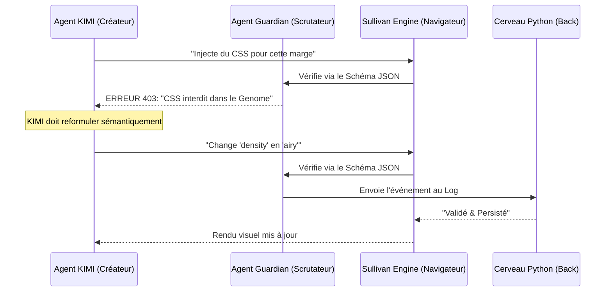

# 01 - Logique du Pont Sémantique AETHERFLOW

Ce document définit la frontière hermétique entre le Système Cognitif (Backend) et le Système de Rendu (Frontend).

## 1. Le Principe du "Contrat Social"
Le `API_CONTRACT_SCHEMA.json` est le mur porteur de l'architecture. Il garantit que :
- Le **Backend** ne parle que "Sens" (Sémantique).
- Le **Frontend** ne parle que "Forme" (Pixels/CSS).

### Pourquoi cette séparation ?
Pour éviter la **Dérive LLM**. Lorsqu'un agent (KIMI/Claude) travaille sur un fichier monolithique, il a tendance à mélanger les responsabilités pour aller plus vite (ex: injecter du style CSS directement dans une fonction Python). Le Pont interdit physiquement cette pratique.

---

## 2. Le Duo Python / JavaScript : Répartition des Rôles

| Acteur | Langage | Territoire | Responsabilité |
| :--- | :--- | :--- | :--- |
| **Cerveau** | Python | Serveur / Disque | Persistance du Genome, ModificationLog, Sécurité. |
| **Mains** | JS | Navigateur (DOM) | Rendu Fabric.js, Drag & Drop, Zoom, Thèmes. |
| **Douane** | JSON | Contrat | Validation des échanges (Liste Blanche). |

---

## 3. Le "Gardien" (Médiation Sémantique)
Le Gardien est un script hybride qui intercepte chaque intention de modification.

## 4. Bénéfices pour le Workflow FRD
- **Stabilité** : Le "Scaffold" est protégé par le code, pas par une promesse de l'IA.
- **Vitesse** : L'IA ne manipule que des leviers sémantiques simples (VRAI/FAUX, Enumérations).
- **Auditabilité** : Chaque changement est un événement daté et signé dans le JSON.
