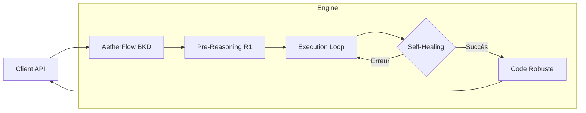

# VISION STRATÉGIQUE : DEEP FLOW & STANDALONE BKD

Ce document définit l'architecture cible d'AetherFlow en tant que produit commercial autonome (BKD standalone).

## 1. La Proposition de Valeur : "Code Solide à Prix Abordable"

Le cœur de la stratégie AetherFlow repose sur l'**Hybridation Raisonnement/Écriture**.
- **DeepSeek-R1 (Le Cerveau)** : Utilisé pour une seule passe de raisonnement profond sur le plan et l'AST. C'est l'assurance qualité qui garantit la "solidité" architecturale.
- **Codestral/Groq/DeepSeek-V3 (La Main)** : Utilisé pour l'écriture itérative du code. Rapide et économique.
- **Résultat** : Le client paie pour l'intelligence stratégique, pas pour le volume de tokens d'écriture coûteux.

## 2. Orchestration : De la Linéarité au "Self-Healing"

### L'Intégration de LangGraph
Pour une API commerciale sans humain dans la boucle, l'arrêt sur erreur est inacceptable.
- **Vision** : Faire évoluer l'orchestrateur actuel vers un **Graphe d'États**.
- **Articulation** : 
    - **Encapsulation** : L'orchestrateur existant peut servir d'exécuteur de nœuds dans LangGraph.
    - **Boucle de feedback** : Toute erreur de syntaxe ou échec de test déclenche un nœud de "Correction" alimenté par le contexte du raisonneur.
    - **Autonomie** : Le moteur doit être capable de "guérir" le code avant de livrer le résultat final via l'API.

## 3. L'Architecture des 4 Plateformes Standalone

AetherFlow s'inscrit dans une vision de 4 produits interopérables mais vendables séparément :

| Plateforme | Rôle | Interaction AetherFlow |
| :--- | :--- | :--- |
| **BRS (Brainstorm)** | Intention & Planification | Génère le `plan.json` pour AetherFlow. |
| **BKD (AetherFlow)** | **Construction de Code** | Le moteur de modification AST et génération logique. |
| **FRD (Sullivan)** | Rendu & Interface | Consomme les APIs BKD pour peupler l'UI. |
| **DPL (Deploy)** | Mise en Production | Récupère le code "Pristine" généré par BKD. |

## 4. Workflows Cibles

## 5. Risques & Inconnues
- **Coût de R1** : Nécessité d'une surveillance étroite sur les plans extrêmement larges (benchmarker le token count).
- **Complexité LangGraph** : Évaluer si une extension de l'orchestrateur actuel suffit ou si une migration complète est nécessaire pour la scalabilité.

---
*Document Stratégique - Février 2026*
