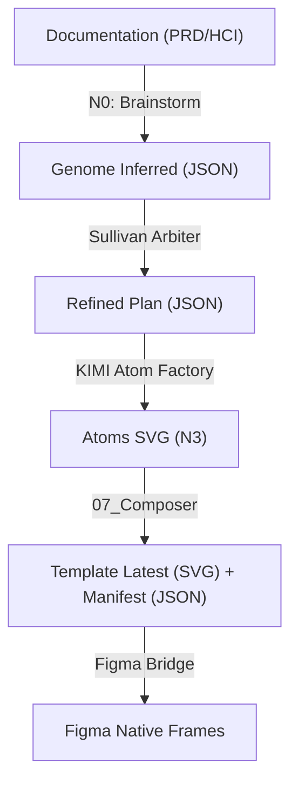

# Rapport Technique : Pipeline de Production AetherFlow

Ce document détaille le flux de production de l'interface AetherFlow, de la capture d'intention initiale (PRD/Docs) jusqu'au rendu final dans Figma via le Bridge JSON.

## 1. Vue d'Ensemble du Flux (The Master Engine)

Le pipeline AetherFlow est une chaîne de montage logicielle où chaque étape raffine l'intention jusqu'à sa matérialisation graphique.

---

## 2. Les Étapes du Pipeline

### Phase A : Stratégie & Intention (N0-N1)
*   **Source** : `AETHERFLOW_MASTER_VISION.md` et documents Sullivan (HCI).
*   **Action** : Le système analyse le PRD pour extraire des entités fonctionnelles.
*   **Modèle Gemini 2.0 Flash** : Utilisé pour la vision globale, le découpage en phases (`n0_brainstorm`, `n0_backend`, etc.) et l'inférence du **Génome**.
*   **Sortie** : `genome_inferred.json` (Le squelette logique).

### Phase B : Intent Refactoring & Sullivan Arbiter
*   **Action** : Confrontation entre l'intention humaine et les capacités techniques.
*   **Sullivan Arbiter** : Agit comme un "garde-fou". Il vérifie que chaque composant prévu répond à un objectif du PRD. Il "score" la pertinence avant la génération.
*   **Sortie** : `refined_plan.json` (Le plan de construction validé).

### Phase C : Fabrication des Atomes (N3)
*   **Action** : Génération isolée de chaque micro-composant (bouton, carte, graphe).
*   **Rôle de KIMI** : C'est notre artisan UI. KIMI reçoit un "prompt de style" et une "intention fonctionnelle" pour chaque ID (`comp_login`). 
    *   *Spécificité KIMI* : Capacité à produire du SVG haute-fidélité, propre et auto-contenu.
*   **Sortie** : `atoms/*.svg` (La bibliothèque de pièces détachées).

### Phase D : Composition & Manifeste (07_Composer)
*   **Action** : Le script Python `07_composer.py` assemble les pièces sur une grille de 12 colonnes.
*   **Nouveauté (Mission 25B)** : En plus de l'image SVG globale, il calcule les coordonnées exactes (x, y) de chaque ID et les écrit dans le `manifest.json`.
*   **Sortie** : `manifest.json` (La "Carte d'identité" du design).

### Phase E : Le Figma Bridge
*   **Action** : Le plugin Figma interroge l'API locale (`http://localhost:9998/api/manifest`).
*   **Rendu Native** : Le plugin ne se contente pas de copier du texte, il recrée des frames Figma, injecte les SVG de KIMI, et prépare le terrain pour l'Auto-Layout.

---

## 3. Rôle des Modèles AI

| Modèle | Rôle | Stage | Force |
| :--- | :--- | :--- | :--- |
| **Gemini 2.0 Flash (API)** | Architecte / Strategist | N0 / N1 | Compréhension long-context, vision globale du système. |
| **Sullivan Arbiter (Inférence)** | Contrôleur Qualité | IR (Refactoring) | Logique TDD, respect de la "Pristine Mode", scoring. |
| **KIMI (Chat/API)** | Artisan Graphique (Designer) | N3 (Atomes) | Excellence visuelle SVG, respect des tokens de design. |
| **Antigravity (Moi)** | Orchestrateur / OPS | Tout le pipeline | Gestion du code, automatisation, intégration Git/Figma. |

---

## 4. Conclusion
Le passage au **Manifeste JSON** libère l'interface de sa prison "image" (SVG unique). L'interface est désormais une collection d'objets intelligents que le designer peut manipuler dans Figma tout en gardant le lien avec le code source d'AetherFlow.
