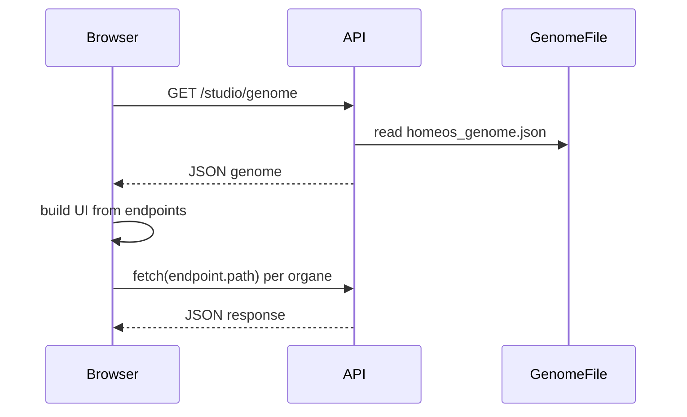

# Plan : Exposition du Genome au frontend et UI dynamique (self-construction)

**Objectif** : Permettre au frontend de charger le genome (API ou fichier) et de générer l’UI dynamiquement (composants/organes, appels API).

---

## Vue d’ensemble



- **Partie 1** : Exposer le genome au front (endpoint ou fichier statique).
- **Partie 2** : Une page + script qui charge ce genome et génère l’UI (organes, boutons, appels API).

---

## Partie 1 : Exposer le genome au front

### Option retenue : endpoint API (recommandé)

- **Pourquoi** : Un seul endpoint peut servir le genome depuis le fichier par défaut, ou depuis un chemin paramétré, et éventuellement régénérer si absent.
- **Alternative** : Servir un fichier statique (ex. `GET /studio/homeos_genome.json`) si on veut zéro logique côté API.

### 1.1 Endpoint `GET /studio/genome`

| Élément | Détail |
|--------|--------|
| **Fichier** | `Backend/Prod/api.py` |
| **Route** | `GET /studio/genome` |
| **Query params** | `path` (optionnel) : chemin vers un genome JSON (sinon défaut `output/studio/homeos_genome.json`) |
| **Réponse** | 200 : body = genome JSON (metadata, topology, endpoints, schema_definitions). 404 si fichier absent. 500 si erreur de lecture. |
| **CORS** | Déjà géré globalement pour le front. |

**Comportement proposé** :

1. Résoudre le chemin : `path` en query si présent, sinon `settings.output_dir / "studio" / "homeos_genome.json"`.
2. Si le fichier n’existe pas : soit 404, soit (optionnel) appeler `generate_genome()` puis servir le fichier généré.
3. Lire le JSON, le renvoyer avec `Content-Type: application/json`.

**Fichiers à toucher** :

- `Backend/Prod/api.py` : ajout de la route `GET /studio/genome`, lecture du fichier (et éventuellement génération), retour du JSON.

### 1.2 (Optionnel) Fichier statique

- Monter un répertoire statique pour `output/studio/` (ex. `/studio/files`) et exposer `homeos_genome.json` comme fichier statique.
- Le front pourrait alors charger `/studio/files/homeos_genome.json`. À documenter si on l’implémente.

---

## Partie 2 : Page + script qui charge le genome et génère l’UI

### 2.1 Objectif

- Une **page** dédiée (ex. Studio dynamique).
- Un **script** qui :
  1. Charge le genome (depuis l’endpoint ou l’URL fichier).
  2. Pour chaque `endpoint` du genome, crée un “organe” (bloc UI) selon `x_ui_hint`.
  3. Attache les handlers (boutons, formulaires) pour appeler l’API (`path`, `method`) et afficher la réponse.

### 2.2 Structure des fichiers proposée

```
Frontend/
├── index.html              # Existant (chatbox)
├── studio.html             # Nouveau : page "Studio" self-construite à partir du genome
├── css/
│   └── styles.css
├── js/
│   ├── app.js              # Existant
│   └── studio-genome.js     # Nouveau : chargement genome + génération organes + fetch
```

- **studio.html** : conteneur minimal (sidebar optionnelle pour topology, zone principale pour les organes), inclusion de `studio-genome.js`.
- **studio-genome.js** : logique de fetch genome, construction du DOM, appels API par organe.

### 2.3 Format du genome (rappel)

Le JSON attendu (aligné sur `homeos_genome.json`) :

- `metadata`: `intent`, `version`, `generated_at`
- `topology`: liste de chaînes (ex. Brainstorm, Back, Front, Deploy)
- `endpoints`: tableau de `{ method, path, x_ui_hint, summary }`
- `schema_definitions`: (optionnel pour une première version) objet de schémas

Le script se base surtout sur `metadata`, `topology` et `endpoints`.

### 2.4 Mapping `x_ui_hint` → composant (organe)

Reprendre la sémantique du builder Sullivan côté serveur, en JS :

| `x_ui_hint` | Rôle | Éléments à générer |
|-------------|------|--------------------|
| `terminal` | Log / texte brut | titre (summary), `<pre>` pour la réponse, bouton "Refresh" |
| `gauge`    | Métrique / indicateur | titre, zone affichage, bouton "Refresh" |
| `status`   | Statut (health, etc.) | titre, zone affichage, bouton "Check" |
| `form`     | Action POST | titre, formulaire (éventuellement champs dérivés de schema plus tard), bouton submit, zone réponse |
| `dashboard`| Liste / tableau | titre, zone affichage, bouton "Load" |
| `detail`   | Détail d’une ressource | titre, zone affichage, bouton "View" |
| `list`     | Liste | titre, zone affichage, bouton "Load" |
| `generic`  | Fallback | titre, zone affichage, bouton "Fetch" |

Pour chaque organe :

- `data-path`, `data-method` (pour le script).
- Un bouton (ou submit) qui déclenche `fetch(BASE_URL + path, { method })` et affiche le résultat dans la zone dédiée (texte ou JSON formaté).

### 2.5 Comportement du script `studio-genome.js`

1. **Config**  
   - URL du genome : par défaut `/studio/genome` (ou variable/const en tête de fichier).  
   - Base URL API : par défaut `window.location.origin` ou valeur configurable.

2. **Chargement du genome**  
   - `fetch(genomeUrl)` → JSON.  
   - Gestion erreur (réseau, 404, JSON invalide) : message utilisateur.

3. **Rendu**  
   - Afficher `metadata.intent` (titre de la page).  
   - Optionnel : afficher `topology` en barre de navigation (liens ancres ou onglets).  
   - Pour chaque `endpoints[]` :  
     - Créer un bloc “organe” selon `x_ui_hint` (fonction par hint ou switch).  
     - Insérer le bloc dans le conteneur principal.  
     - Attacher l’écouteur sur le bouton/submit : au clic/submit, appeler l’API avec `path` et `method`, afficher la réponse dans l’organe.

4. **Appels API**  
   - `fetch(baseUrl + endpoint.path, { method: endpoint.method, headers: { "Content-Type": "application/json" }, body: ... })`.  
   - Pour les POST avec formulaire : collecter les champs (si on en ajoute) ou envoyer `{}` dans un premier temps.  
   - Afficher `response.json()` ou `response.text()` dans la zone de sortie de l’organe (ex. `JSON.stringify(..., null, 2)` ou texte brut).

5. **Styles**  
   - Réutiliser le style “brutalist” du builder (ou une feuille dédiée `studio.css`) pour rester cohérent avec `studio_index.html` généré côté serveur.

### 2.6 Points d’extension (hors scope minimal)

- Utiliser `schema_definitions` pour générer des champs de formulaire (ex. pour `form`).
- Filtrage des endpoints (par topology ou tag).
- Gestion du chargement (skeleton ou spinner) pendant le fetch du genome et des appels API.

---

## Ordre d’implémentation recommandé

1. **Backend**  
   - Ajouter `GET /studio/genome` dans `api.py` (lecture fichier défaut, optionnellement génération si absent).  
   - Tester avec `curl` ou navigateur.

2. **Frontend – chargement**  
   - Créer `studio.html` (structure de base + conteneur pour organes).  
   - Créer `studio-genome.js` : fetch du genome, parsing, affichage de `metadata` + `topology` (titre + nav simple).

3. **Frontend – organes**  
   - Implémenter une fonction “renderOrgane(endpoint, baseUrl)” (ou équivalent) avec un switch sur `x_ui_hint`.  
   - Brancher les boutons sur `fetch` et affichage de la réponse.  
   - Couvrir au minimum : `generic`, `terminal`, `status`, `form`, `dashboard`.

4. **Intégration**  
   - Lien depuis la chatbox (ou la home) vers `studio.html`.  
   - Vérifier CORS et base URL (dev vs prod).  
   - Documenter l’URL du genome (endpoint vs fichier statique si utilisé).

5. **Optionnel**  
   - Fichier statique pour le genome.  
   - `schema_definitions` pour formulaires.  
   - Styles dédiés `studio.css`.

---

## Fichiers impactés (résumé)

| Fichier | Action |
|---------|--------|
| `Backend/Prod/api.py` | Ajouter `GET /studio/genome` |
| `Frontend/studio.html` | Créer (page Studio) |
| `Frontend/js/studio-genome.js` | Créer (logique genome + organes + fetch) |
| `Frontend/css/styles.css` ou `studio.css` | Étendre ou créer pour styles organes/studio |
| `Frontend/index.html` (ou menu) | Optionnel : lien vers Studio |

---

## Critères de succès

- Le frontend peut récupérer le genome via `GET /studio/genome` (ou URL fichier documentée).
- Une page (ex. `studio.html`) charge ce genome et affiche au moins les endpoints sous forme d’organes (un bloc par endpoint).
- Chaque organe permet de déclencher l’appel API correspondant (method + path) et d’afficher la réponse.
- Comportement correct pour les hints : `terminal`, `status`, `form`, `dashboard`, `generic` (les autres peuvent revenir au même rendu que `generic` dans un premier temps).
