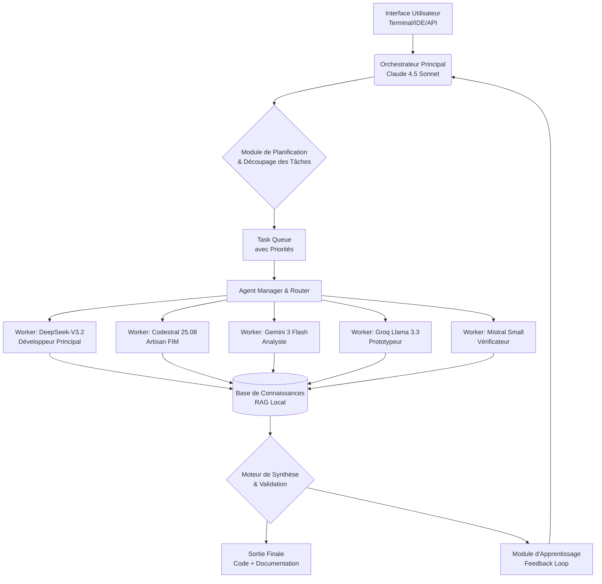
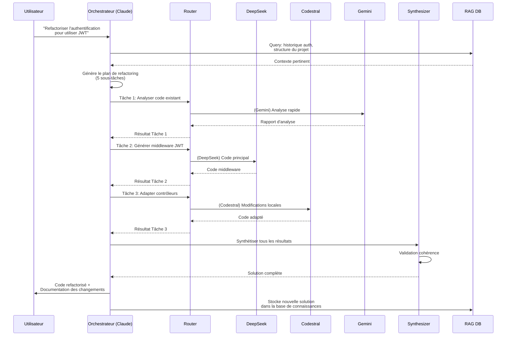

Voici un PRD (Product Requirements Document) détaillé pour votre pipeline d'agents IA spécialisés.

Product Requirements Document (PRD) : Pipeline d'Orchestration d'Agents IA Spécialisés

1. Vue d'Ensemble & Objectifs

Nom du Produit : AetherFlow - Orchestrateur d'Agents IA pour le Développement Logiciel
Version : 1.0
Date : Mars 2026

1.1. Énoncé du Problème

Les développeurs et équipes techniques font face à un paysage fragmenté d'outils d'IA :

· Les modèles LLM généralistes (Claude, GPT) sont excellents pour la compréhension mais chers pour l'exécution détaillée.
· Les modèles spécialisés code (DeepSeek, Codestral) sont économiques mais manquent de capacités de planification stratégique.
· L'absence d'orchestration intelligente entre ces modèles conduit à des coûts élevés, une qualité incohérente et des flux de travail manuels inefficaces.

1.2. Vision du Produit

Créer un système autonome qui agit comme un "CTO Virtuel" capable de décomposer n'importe quelle tâche de développement logiciel en sous-tâches spécialisées, de les router vers les agents IA les plus performants et économiques pour chaque sous-domaine, et de synthétiser les résultats en une solution cohérente.

1.3. Objectifs Clés (OKRs)

· Performance : Atteindre un taux de réussite de >85% sur SWE-Bench (benchmark de résolution de problèmes logiciels) en orchestrant des agents spécialisés, contre 40-60% pour un modèle unique.
· Coût : Réduire le coût moyen par tâche de développement de 70% par rapport à l'utilisation exclusive de Claude 4.5 Sonnet.
· Vitesse : Réduire le temps de résolution de tâches complexes de 50% grâce à l'exécution parallèle et à la spécialisation.
· Maintenabilité : Concevoir un système où tout agent peut être mis à jour ou remplacé sans refonte de l'architecture.

---

2. Spécifications Techniques Détaillées

2.1. Architecture Système



2.2. Composants Techniques

2.2.1. Orchestrateur Principal (Claude 4.5 Sonnet)

Responsabilités :

· Compréhension de l'intention utilisateur en langage naturel
· Analyse du contexte du projet via le système RAG
· Découpage de la tâche en sous-tâches atomiques
· Attribution de chaque sous-tâche à l'agent optimal
· Supervision de l'exécution et gestion des erreurs
· Synthèse finale des résultats

Interface Technique :

```python
class Orchestrator:
    def process_request(self, user_query: str, context: ProjectContext) -> TaskPlan:
        """
        Transforme une requête utilisateur en plan d'exécution détaillé
        """
        plan_prompt = f"""
        Contexte: {context}
        Requête: {user_query}
        
        Génère un plan JSON avec:
        1. Liste des sous-tâches atomiques
        2. Agent assigné pour chacune (deepseek, codestral, gemini, groq, mistral)
        3. Dépendances entre tâches
        4. Critères de validation
        """
        return self.claude_api.call(plan_prompt)
```

2.2.2. Système de Routage Intelligent

Algorithme de Sélection d'Agent :

```python
class AgentRouter:
    def select_agent(self, task: Task) -> Agent:
        decision_matrix = {
            "code_generation_large": {
                "agent": "deepseek_v3",
                "conditions": [
                    task.complexity > 0.7,
                    task.size_in_tokens > 500,
                    task.type in ["module_creation", "refactoring_major"]
                ]
            },
            "code_edition_precise": {
                "agent": "codestral",
                "conditions": [
                    task.type in ["rename", "extract_method", "fix_syntax"],
                    task.context_required == "local_scope"
                ]
            },
            "rapid_prototyping": {
                "agent": "groq_llama",
                "conditions": [
                    task.speed_priority > 0.8,
                    task.quality_threshold < 0.7,
                    task.type == "brainstorming"
                ]
            },
            "data_analysis": {
                "agent": "gemini_flash",
                "conditions": [
                    task.type in ["log_analysis", "doc_parsing", "json_processing"],
                    task.speed_priority > 0.6
                ]
            },
            "light_validation": {
                "agent": "mistral_small",
                "conditions": [
                    task.cost_sensitivity > 0.9,
                    task.complexity < 0.3
                ]
            }
        }
```

2.2.3. Base de Connaissances RAG

Spécifications :

· Moteur Vectoriel : ChromaDB ou Qdrant avec persistance locale
· Embeddings : Modèle spécialisé code (e.g., all-miniLM-L6-v2 fine-tuné)
· Indexation :
  · Code source du projet (par fichiers, fonctions)
  · Historique des décisions techniques
  · Documentation API et bibliothèques
  · Patterns et solutions récurrentes
· Mise à jour : Indexation incrémentielle à chaque commit/évolution

2.2.4. Pipeline d'Exécution

```python
class ExecutionPipeline:
    async def execute_plan(self, plan: TaskPlan) -> ExecutionResult:
        """Exécute un plan de tâches avec parallélisation intelligente"""
        
        # 1. Validation du plan
        if not self.validate_plan(plan):
            raise InvalidPlanError("Plan de tâches invalide")
        
        # 2. Exécution parallèle des tâches indépendantes
        independent_tasks = self.extract_independent_tasks(plan)
        results = await asyncio.gather(*[
            self.execute_task(task) for task in independent_tasks
        ])
        
        # 3. Exécution séquentielle des tâches dépendantes
        dependent_results = []
        for task_group in self.topological_sort(plan.dependent_tasks):
            for task in task_group:
                result = await self.execute_task(task)
                dependent_results.append(result)
        
        # 4. Synthèse des résultats
        final_output = await self.synthesize_results(
            results + dependent_results
        )
        
        return ExecutionResult(
            success=True,
            output=final_output,
            metrics=self.collect_metrics()
        )
```

2.3. Interfaces et Protocoles

2.3.1. Format d'Échange de Données

```typescript
interface TaskSpecification {
    id: string;
    type: TaskType;
    description: string;
    input_format: 'code' | 'text' | 'json' | 'mixed';
    expected_output: {
        format: string;
        constraints: string[];
        quality_metrics: Metric[];
    };
    context: {
        files: FileReference[];
        relevant_history: string[];
        constraints: TechnicalConstraint[];
    };
    assigned_agent: AgentType;
    fallback_strategy: FallbackPlan;
}

interface AgentResponse {
    task_id: string;
    agent: AgentType;
    output: any;
    confidence_score: number;
    tokens_used: number;
    execution_time_ms: number;
    metadata: {
        model_used: string;
        temperature: number;
        reasoning_trace?: string;
    };
}
```

2.3.2. API Externes Intégrées

Fournisseur Point de Terminaison Modèle Principal Clé de Configuration
Anthropic api.anthropic.com/v1 Claude 4.5 Sonnet ANTHROPIC_API_KEY
DeepSeek api.deepseek.com/v1 DeepSeek-V3.2 DEEPSEEK_API_KEY
Google AI generativelanguage.googleapis.com Gemini 3 Flash GOOGLE_API_KEY
Groq api.groq.com/v1 Llama 3.3 70B GROQ_API_KEY
Mistral api.mistral.ai/v1 Codestral 25.08 MISTRAL_API_KEY

---

3. Flux de Travail Détaillé

3.1. Séquence d'Exécution Complète



3.2. Scénarios d'Utilisation Détails

3.2.1. Refactoring Majeur

Input : "Transforme notre API REST monolithique en architecture microservices"

Processus :

1. Phase d'Analyse (Gemini Flash)
   · Analyse de la codebase existante
   · Identification des boundaries contextuelles
   · Rapport de couplage et de cohésion
2. Phase de Conception (Claude 4.5)
   · Définition des services
   · Design des APIs inter-services
   · Plan de migration progressive
3. Phase d'Implémentation (DeepSeek)
   · Génération du code de chaque service
   · Création des clients SDK
   · Configuration d'orchestration (Docker, Kubernetes)
4. Phase d'Adaptation (Codestral)
   · Mise à jour des appels clients
   · Refactoring des tests
   · Corrections d'incompatibilités
5. Phase de Validation (Mistral + Groq)
   · Tests de performance rapides
   · Validation de la syntaxe
   · Génération de scénarios de test

3.2.2. Débogage Complexe

Input : "L'endpoint /api/process échoue silencieusement sous charge"

Processus :

1. Collecte (Gemini) : Analyse des logs, métriques, traces
2. Hypothèses (Groq) : Génération rapide d'hypothèses de causes racines
3. Investigation (DeepSeek) : Analyse détaillée du code suspect
4. Correctif (Codestral) : Application du fix minimal
5. Validation (Mistral) : Tests du correctif
6. Documentation (Claude) : Explication de la cause et du correctif

---

4. Métriques et Surveillance

4.1. KPIs (Key Performance Indicators)

Catégorie Métrique Cible Mesure
Performance Taux de réussite des tâches >85% (Tâches réussies / Total tâches)
 Temps moyen de résolution <30 min De la requête à la livraison
 Précision du code généré >90% Tests unitaires passants
 **TTFT (Time To First Token)** **<2s** Temps avant premier token reçu
 **TTR (Time To Response)** **<30s** Temps total de réponse complète
 **Cache Hit Rate** **>60%** % requêtes utilisant cache prompt
 **Speculative Accept Rate** **>70%** % tokens/branches acceptés (draft+verify)
Économique Coût moyen par tâche <$0.50 Sum(cost_agent_i)
 Économie vs Claude seul >70% (Cost_Claude - Cost_Orchestré)/Cost_Claude
 ROI mensuel >5x (Valeur temps sauvé) / Coût API
 **Cache Read Cost** **0.1×** Coût cache vs génération complète
Qualité Satisfaction développeur >4.5/5 Survey NPS
 Taux d'adoption >80% (Utilisations / Opportunités)
 Réduction des bugs >40% Bugs introduits par IA vs manuel
 **Code Quality Score** **>90%** Score qualité code généré (linting, tests)
 **First Try Success Rate** **>85%** % code fonctionnel du premier coup

4.2. Tableau de Bord de Surveillance

```python
class MonitoringDashboard:
    metrics = {
        "api_calls": {
            "by_agent": {"deepseek": 0, "claude": 0, "gemini": 0},
            "success_rate": 0.95,
            "latency_p95": 1500  # ms
        },
        "cost_tracking": {
            "daily_budget": 10.00,  # $
            "current_spend": 3.42,
            "cost_per_task": 0.23,
            "savings_vs_claude": 72.5  # %
        },
        "quality_metrics": {
            "code_compilation_rate": 0.96,
            "test_pass_rate": 0.89,
            "developer_approval_rate": 0.94
        },
        "rag_efficiency": {
            "cache_hit_rate": 0.65,
            "context_relevancy_score": 0.88,
            "knowledge_base_size": "15.4GB"
        }
    }
```

---

5. Stratégie de Déploiement et Roadmap

5.1. Phase 1 (M0-M1) : MVP

· Orchestrateur Claude + DeepSeek seulement
· RAG basique avec indexation de code
· Interface ligne de commande
· Métriques de base (coût, succès)

5.2. Phase 2 (M2-M3) : Spécialisation

· Intégration de Codestral pour le FIM
· Ajout de Gemini pour l'analyse
· Système de routage intelligent
· Tableau de bord web

5.3. Phase 3 (M4-M6) : Optimisation

· Intégration de Groq et Mistral
· Pipeline d'exécution parallèle
· Apprentissage par feedback
· Optimisation des coûts en temps réel
· **Réduction de latence API** :
  - Prompt caching (Claude/Anthropic) - Réduction TTFT 30-60%
  - SLM locaux (Ollama) pour validation/formatage - Réduction appels externes 20-40%
  - Speculative decoding (draft + verify) - Speedup factor >1.5×
  - Cache sémantique local (Redis + Vector DB) - Cache hit rate >40%
  - WebSockets/connexions persistantes - Réduction overhead réseau >30%

5.4. Phase 4 (M7-M12) : Enterprise

· Support multi-projets
· Collaboration d'équipe
· Intégrations CI/CD
· Governance et compliance

---

6. Considérations Techniques Avancées

6.1. Gestion des Erreurs et Résilience

```python
class ResilienceManager:
    strategies = {
        "agent_failure": [
            "retry_with_same_agent",
            "fallback_to_next_best_agent",
            "simplify_task_and_retry",
            "human_intervention_request"
        ],
        "api_limit_hit": [
            "switch_to_backup_provider",
            "queue_and_retry_later",
            "degrade_gracefully"
        ],
        "quality_threshold_not_met": [
            "regenerate_with_different_params",
            "combine_multiple_attempts",
            "escalate_to_higher_cost_agent"
        ]
    }
```

6.2. Optimisation des Coûts

```python
class CostOptimizer:
    def optimize_agent_selection(self, task: Task, budget: float) -> AgentSelection:
        """
        Sélectionne l'agent optimal sous contrainte budgétaire
        """
        # Modèle de prédiction de coût par agent
        cost_predictions = {
            "claude": self.predict_cost(task, "claude"),
            "deepseek": self.predict_cost(task, "deepseek"),
            "codestral": self.predict_cost(task, "codestral"),
            # ...
        }
        
        # Modèle de prédiction de qualité
        quality_predictions = {
            "claude": self.predict_quality(task, "claude"),
            # ...
        }
        
        # Optimisation multi-objectif
        return self.multi_objective_optimization(
            objectives=[minimize(cost), maximize(quality)],
            constraints=[cost <= budget],
            variables=agent_choices
        )
```

6.3. Réduction de Latence API

**Stratégie d'optimisation** : Réduire la latence perçue via plusieurs techniques complémentaires.

**Techniques principales** :

1. **Prompt Caching** (Claude/Anthropic)
   - Réduction TTFT estimée : **30-60%**
   - Cache hit rate cible : **>60%**
   - Coût : Cache reads = 0.1× prix input
   - TTL : 5 minutes (ephemeral) ou 1 heure (payant)

2. **SLM Locaux** (Ollama)
   - Réduction appels externes : **20-40%**
   - Utilisation : Validation, formatage, linting
   - Modèles : Phi-4, Qwen-2.5-Coder 7B
   - Latence cible : **<1s**

3. **Speculative Decoding** (Draft + Verify)
   - Pattern : Draft model (SLM local/Groq) → Verify (Claude/Gemini)
   - Accept rate cible : **>70%**
   - Speedup factor cible : **>1.5×**

4. **Cache Sémantique Local** (Redis + Vector DB)
   - Déduplication réponses similaires
   - Cache hit rate cible : **>40%**
   - Search latency cible : **<100ms**

5. **WebSockets/Connexions Persistantes**
   - Réduction overhead réseau : **>30%**
   - Amélioration TTFT : **>20%**
   - Utile pour sessions longues

**Métriques à tracker** :
- TTFT (Time To First Token) - Cible <2s
- TTR (Time To Response) - Cible <30s
- Cache Hit Rate (Prompt) - Cible >60%
- Cache Hit Rate (Sémantique) - Cible >40%
- Speculative Accept Rate - Cible >70%
- SLM Call Rate - Cible >30%
- Network Calls Saved - Cible >20%

**Référence** : Voir `/docs/guides/Plan de rédcution de la latence API.md` et `/docs/guides/STRATEGIE_BENCHMARK_LATENCE.md` pour détails complets.

---

7. Annexe : Matrice de Décision Complète

Type de Tâche Agent Primaire Agent Secondaire Conditions de Basculage
Génération module complet DeepSeek-V3.2 Claude 4.5 Si complexité > seuil
Refactoring local Codestral DeepSeek Si portée dépasse 50 LOC
Analyse logs/Données Gemini 3 Flash Claude 4.5 Si besoin de raisonnement profond
Brainstorming architecture Groq Llama Claude 4.5 Pour vitesse initiale
Validation syntaxe Mistral Small Codestral Si corrections complexes nécessaires
Debugging complexe Claude 4.5 DeepSeek + Gemini Multi-étape nécessitant raisonnement
Documentation Claude 4.5 Gemini Flash Selon longueur et détail requis

---

Statut du Document : Version 1.1 - Approuvé pour l'implémentation
Dernière mise à jour : 26 janvier 2025 (Réduction latence API intégrée)
Prochaine Revue : Après la Phase 2 (Optimisation)
Responsables : Équipe d'Architecture IA / Développement Produit

Ce PRD sert de référence complète pour l'implémentation de votre pipeline d'orchestration d'agents IA spécialisés. Chaque section peut être détaillée en spécifications techniques individuelles lors de l'implémentation.