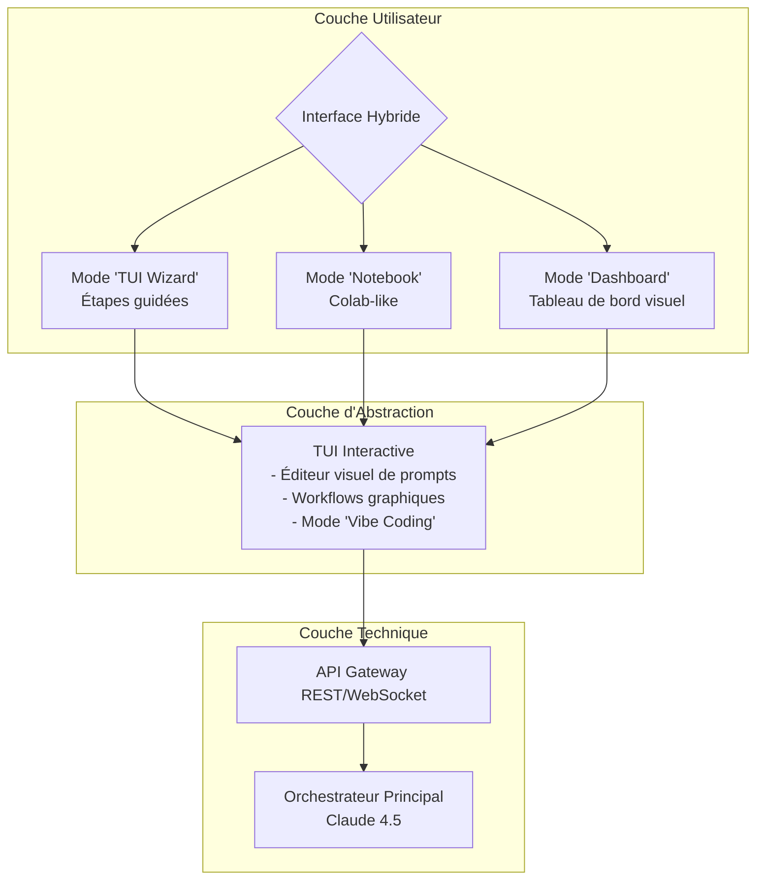

Addendum FRONTEND au PRD AetherFlow - Interface "Maker-Centric"

8. Stratégie d'Interface Utilisateur - Approche TUI-First

8.1 Philosophie d'Interface

Pour les Makers, pas les Puristes DevOps

```
Ancien paradigme :          Nouveau paradigme :
Dev → Terminal → Code       Maker → Interface → Résultat
    (abstraction)               (concrétisation)
```

8.2 Architecture Frontend Multi-Couches



8.3 Interface TUI Détaillée

8.3.1 TUI Framework Sélection : Textual ou Rich

· Textual : Framework moderne, React-like pour terminaux
· Rich : Plus simple, bon pour les prototypes

```python
# Exemple de structure Textual
from textual.app import App, ComposeResult
from textual.widgets import Header, Footer, Input, Button, Select

class AetherFlowTUI(App):
    CSS = """
    Screen {
        background: $surface;
    }
    
    .wizard-step {
        padding: 1 2;
        border: solid $primary;
    }
    """
    
    def compose(self) -> ComposeResult:
        yield Header()
        yield WizardSteps()
        yield CodePreview()
        yield AgentStatusPanel()
        yield Footer()
```

8.3.2 Écrans Principaux

Écran 1 : Dashboard Principal

```
┌──────────────────────────────────────────────────┐
│            🚀 AETHERFLOW MAKER STUDIO            │
├──────────────────────────────────────────────────┤
│  Projet : mon-api-backend                        │
│  Status : ● En ligne                             │
│  Coût aujourd'hui : $0.42                        │
│                                                  │
│  RACCOURCIS :                                    │
│  [F1] Mode Code           [F2] Mode Analyse      │
│  [F3] Mode Debug          [F4] Mode Génération   │
│                                                  │
│  DERNIÈRES ACTIONS :                             │
│  ► 14:32 : Refactor auth.js (✓)                  │
│  ► 14:45 : Généré API produits (⚡)              │
│  ► 15:10 : Debug middleware (⚠️)                 │
│                                                  │
│  [C] Créer nouveau    [O] Ouvrir    [Q] Quitter  │
└──────────────────────────────────────────────────┘
```

Écran 2 : Mode "Vibe Coding" (Notebook-like)

```
┌──────────────────────────────────────────────────┐
│ #️⃣  Tâche : Ajouter auth JWT à l'API            │
├──────────────────────────────────────────────────┤
│ CELLULE 1 : Contexte                             │
│ Je veux ajouter une authentification JWT à mon   │
│ API Express. J'ai déjà une route /login qui      │
│ retourne un user. Besoin middleware protect.     │
│                                                  │
│ [🔄 Analyser le projet] [📁 Importer fichiers]   │
├──────────────────────────────────────────────────┤
│ CELLULE 2 : Plan généré par AetherFlow           │
│ ✅ 1. Créer middleware authenticateJWT           │
│ ✅ 2. Générer tokens dans /login                 │
│ ✅ 3. Protéger routes avec middleware            │
│ ✅ 4. Ajouter refresh token                      │
│                                                  │
│ [▶ Exécuter étape 1] [▶▶ Exécuter tout]         │
├──────────────────────────────────────────────────┤
│ CELLULE 3 : Code généré (étape 1)               │
│ // middleware/jwt.js                             │
│ const jwt = require('jsonwebtoken');             │
│                                                  │
│ function authenticateJWT(req, res, next) {       │
│   const token = req.header('Authorization');     │
│   // ...                                         │
│ }                                                │
│                                                  │
│ [✅ Accepter] [✏️ Modifier] [🔄 Regénérer]     │
└──────────────────────────────────────────────────┘
```

Écran 3 : Mode "Wizard" (Étapes guidées)

```
┌──────────────────────────────────────────────────┐
│         🧙 WIZARD : Créer une API REST          │
│              Étape 2/5 - Modèles                │
├──────────────────────────────────────────────────┤
│ Quel type de données gérerez-vous ?             │
│                                                  │
│ [ ] Utilisateurs (nom, email, password)         │
│ [ ] Produits (titre, prix, catégorie)           │
│ [ ] Commandes (date, statut, montant)           │
│ [ ] Articles (titre, contenu, auteur)           │
│ [ ] Personnalisé...                             │
│                                                  │
│ Exemple de modèle généré :                      │
│                                                  │
│ const userSchema = new Schema({                 │
│   name: { type: String, required: true },       │
│   email: { type: String, unique: true },        │
│   password: { type: String, required: true }    │
│ });                                             │
│                                                  │
│ [← Retour] [Suivant →] [Sauter cette étape]     │
└──────────────────────────────────────────────────┘
```

8.4 Composants UI Spéciaux pour Makers

8.4.1 "Code Lens" - Visualisation du code

```python
class CodeLens(Widget):
    """Montre le code avec des overlays visuels"""
    
    def render_code_with_overlays(self, code: str, insights: list):
        # Surlignage syntaxique
        # Overlay des suggestions
        # Tooltips sur les fonctions
        # Visualisation des dépendances
```

8.4.2 "Flow Builder" - Construction visuelle de workflows

```
[FICHIER ENTREE] → [TRANSFORMATION] → [FICHIER SORTIE]
    │                       │                    │
    ▼                       ▼                    ▼
  auth.js         "Convertir en JWT"       auth-jwt.js
              ├─[Middleware]                     │
              ├─[Tokens]                        │
              └─[Routes protégées]             │
```

8.4.3 "Agent Theater" - Visualisation des agents en action

```
AGENTS EN ACTION :
┌─────────────────┐  ┌─────────────────┐  ┌─────────────────┐
│   CLAUDE 4.5    │  │   DEEPSEEK V3   │  │    CODestral    │
│   Planificateur │  │  Développeur    │  │    Artisan      │
├─────────────────┤  ├─────────────────┤  ├─────────────────┤
│ Analysé la tâche│  │ Génère le code  │  │ Édite le fichier│
│ Créé un plan    │  │ principal       │  │ auth-middleware │
│ de 5 étapes     │  │ middleware      │  │ .js             │
│                 │  │ jwt.js          │  │                 │
│ ●●●○○ 60%       │  │ ●●●●○ 80%       │  │ ●●○○○ 40%       │
└─────────────────┘  └─────────────────┘  └─────────────────┘
```

8.5 Intégrations Spéciales

8.5.1 Mode "Fine-Tuning Assistant"

```
┌──────────────────────────────────────────────────┐
│         🔧 ASSISTANT FINE-TUNING                │
├──────────────────────────────────────────────────┤
│ DATASET :                                        │
│ [📁] dialogue_pairs.json (1,200 échantillons)   │
│                                                  │
│ PARAMÈTRES :                                     │
│ [⚙️] Modèle : Llama 3.1 8B                     │
│ [📊] Epochs : [3 ████████████░░]                │
│ [🌡️] Learning Rate : 2e-4                      │
│                                                  │
│ RESSOURCES :                                     │
│ [💻] GPU : T4 (16GB)                            │
│ [⏱️] Temps estimé : 45 minutes                  │
│ [💰] Coût estimé : $0.85                        │
│                                                  │
│ [▶ Lancer l'entraînement] [💾 Sauvegarder preset]
└──────────────────────────────────────────────────┘
```

8.6 Workflows Spéciaux pour Makers

8.6.1 "Dump & Understand" - Debug visuel

```python
class DumpAndUnderstand:
    """
    Pour makers qui dumpent des variables pour comprendre
    le comportement du code
    """
    
    def process(self, code_with_dumps: str):
        # 1. Détecte les var_dump(), console.log(), print(), debug()
        # 2. Exécute en sandbox
        # 3. Montre les résultats dans un panneau dédié
        # 4. Propose des corrections et optimisations
```

8.6.2 "Legacy to Modern" - Migration assistée

```
┌──────────────────────────────────────────────────┐
│      CODE LEGACY → CODE MODERNE                 │
├──────────────────────────────────────────────────┤
│ [Glisser fichier legacy ici]                     │
│                                                  │
│ DÉTECTÉ :                                        │
│ ✅ Callbacks imbriqués                           │
│ ✅ Patterns jQuery                               │
│ ✅ Requêtes synchrones                           │
│                                                  │
│ CONVERTIR EN :                                   │
│ [ ] Code async/await moderne                     │
│ [ ] Framework moderne (React/Vue)                │
│ [ ] API REST structurée                          │
│ [ ] TypeScript                                   │
│                                                  │
│ [🔁 Convertir] [📊 Aperçu]                      │
└──────────────────────────────────────────────────┘
```

8.7 Système d'Aide Contextuel

8.7.1 "Maker Tips" - Conseils non-techniques

```
💡 CONSEIL MAKER :
"Plutôt que de chercher la solution parfaite, demandez-vous :
'À quel moment EST-CE QUE JE VEUX que ça se passe ?'

Exemple : 'Quand l'utilisateur se connecte' → Event listener 'login'
Exemple : 'Avant d'afficher les données' → Middleware 'beforeRender'
```

8.7.2 "Analogies" - Explications par comparaison

```
🔧 CONCEPT : Les Middlewares

Pensez-y comme un FILTRE à café :
1. La requête HTTP = Eau chaude
2. Les middlewares = Filtres successifs
3. La réponse = Café filtré

Chaque middleware peut :
- Ajouter du sucre (ajouter des headers)
- Changer la température (modifier la requête)
- Bloquer si mauvais goût (rejeter non-authentifié)
```

8.8 Roadmap Frontend

Phase 1 (M0-M2) : TUI Minimal Viable

· Interface Textual de base
· Mode "Wizard" simple
· Visualisation des agents
· Sortie code dans terminal

Phase 2 (M3-M4) : Interface Hybride

· Serveur web local (localhost:3000)
· Interface browser simple
· Glisser-déposer de fichiers
· Prévisualisation code

Phase 3 (M5-M6) : Desktop App

· Application Electron/TAURI
· Interface native
· Menu système
· Notifications
· Intégration OS

Phase 4 (M7+) : Cloud + Collaboration

· Interface web complète
· Partage de projets
· Collaboration en temps réel
· Marketplace de templates

8.9 Spécifications Techniques Frontend

8.9.1 Stack Technologique

```
TUI Layer :
  - Framework : Textual (Python)
  - Terminal : Compatible iTerm2, Kitty, Windows Terminal
  - Charts : Unicode/ASCII art ou intégration Sixel

Web Layer (optionnel) :
  - Frontend : Svelte ou Vue.js (léger)
  - Backend : FastAPI (même que l'orchestrateur)
  - Websockets : Pour updates en temps réel

Desktop Layer :
  - Framework : TAURI (Rust + Web) ou Electron
  - Packaging : .app, .exe, .deb, .rpm
```

8.9.2 Configuration Minimaliste

```yaml
# ~/.aetherflow/config.yaml
ui:
  mode: "tui"  # ou "web", "desktop"
  theme: "maker-dark"
  
maker_features:
  vibe_mode: true
  visual_workflows: true
  dump_and_understand: true
  
accessibility:
  font_size: 16
  high_contrast: false
  reduce_animations: false
```

8.10 Métriques UX pour Makers

Métrique Cible Mesure
Time to First Result < 2 minutes De l'installation au premier code généré
Learning Curve < 15 minutes Temps pour accomplir une tâche complexe
Visual Clarity > 90% satisfaction Survey "Je comprends ce qui se passe"
Reduction in Googling > 70% Moins de recherches externes nécessaires
Maker Confidence > 4.5/5 "Je me sens capable" survey

8.11 Principes de Design

1. "Show, Don't Tell" - Toujours montrer des exemples concrets
2. "Progressive Disclosure" - Complexité seulement quand nécessaire
3. "Error Forgiveness" - Toujours permettre de revenir en arrière
4. "Contextual Learning" - Enseigner pendant qu'on fait
5. "Maker Metaphors" - Utiliser des analogies du monde physique

---

Cet addendum transforme AetherFlow d'un outil DevOps en un véritable "Maker Studio" - un environnement conçu pour les makers pratiques qui préfèrent apprendre en faisant plutôt qu'en étudiant la théorie.

La TUI devient votre atelier numérique, où vous pouvez :

· Voir ce que font les agents en temps réel
· Comprendre via des analogies concrètes
· Expérimenter sans crainte de casser
· Apprendre en faisant, pas en étudiant
· Itérer rapidement avec feedback visuel immédiat