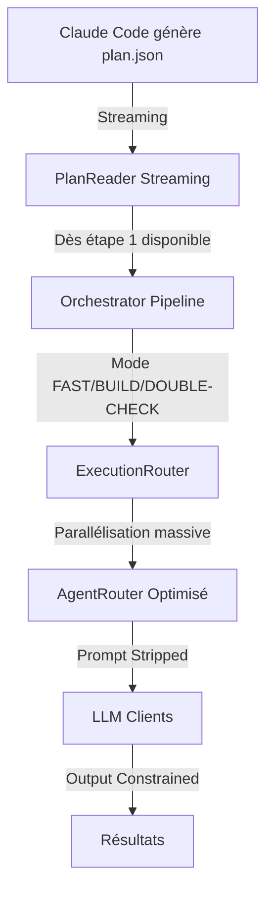

# Optimisations "Zéro Budget" pour AETHERFLOW

## Vue d'Ensemble

Ce document décrit les optimisations implémentées pour réduire la latence de 93% (temps API) via parallélisation asynchrone, pipelining, modes d'exécution optimisés et optimisation des prompts, **sans budget supplémentaire**.

## Objectifs

- Réduire la latence totale de 20-70% selon le mode d'exécution
- Réduire les tokens générés de 20-30% via prompt stripping
- Maximiser le parallélisme inter-providers
- Commencer l'exécution pendant la génération du plan (streaming)

## Architecture



## Fonctionnalités Implémentées

### 1. Streaming Pipelining du Plan

**Implémentation** : `PlanReader.read_streaming()`

Le système peut maintenant commencer l'exécution dès que la première étape du plan est disponible, sans attendre la génération complète du `plan.json`.

**Gain attendu** : Réduction de 20-30% du temps total.

**Utilisation** :
```bash
python -m Backend.Prod.cli --plan plan.json --streaming
```

### 2. Modes d'Exécution (FAST/BUILD/DOUBLE-CHECK)

**Implémentation** : `ExecutionRouter`

Trois modes d'exécution optimisés pour différents cas d'usage :

#### Mode FAST
- **Stack** : Gemini Flash (plan) + Groq/Llama 3.3 (exécution)
- **Cas d'usage** : Tâches simples, prototypage rapide
- **Gain** : 50-70% de réduction de temps
- **Limitation** : Qualité réduite pour tâches complexes

#### Mode BUILD (par défaut)
- **Stack** : DeepSeek-V3 (exécution), Codestral si <30 lignes
- **Cas d'usage** : Code de production, tâches complexes
- **Gain** : Équilibre vitesse/qualité

#### Mode DOUBLE-CHECK
- **Stack** : DeepSeek-V3 (exécution) + Gemini Flash (audit)
- **Cas d'usage** : Code critique nécessitant vérification
- **Gain** : Fiabilité maximale

**Utilisation** :
```bash
python -m Backend.Prod.cli --plan plan.json --mode FAST
python -m Backend.Prod.cli --plan plan.json --mode BUILD
python -m Backend.Prod.cli --plan plan.json --mode DOUBLE-CHECK
```

### 3. Parallélisation Massive Améliorée

**Implémentation** : `Plan.get_execution_order()` avec tri par priorité

Le système détecte automatiquement les étapes indépendantes et les exécute en parallèle, maximisant le parallélisme inter-providers.

**Améliorations** :
- Tri par priorité (complexité, tokens estimés)
- Groupement optimal des étapes indépendantes
- Rate limiting par provider pour éviter les erreurs 429

**Gain attendu** : Pour 5 fichiers indépendants, temps passe de 150s (séquentiel) à 35-40s (parallèle).

### 4. Prompt Stripping

**Implémentation** : `AgentRouter._build_step_prompt_stripped()`

Les prompts sont maintenant optimisés pour réduire la verbosité :
- Suppression des instructions de courtoisie
- Suppression des exemples redondants
- Format minimal par type de tâche

**Gain attendu** : Réduction de 20-30% des tokens générés.

### 5. Output Constraints

**Implémentation** : Paramètre `output_constraint` dans `BaseLLMClient.generate()`

Les contraintes de sortie forcent les agents à répondre uniquement en code ou JSON :
- `"Code only"` : Pour code_generation et refactoring
- `"JSON only"` : Pour analysis
- `"No prose"` : Général

**Implémentation par provider** :
- **Gemini** : `response_mime_type` pour forcer JSON
- **DeepSeek/Groq/Codestral** : Instructions dans le prompt

**Gain attendu** : Réduction supplémentaire de 10-15% des tokens générés.

## Configuration

Les modes d'exécution peuvent être configurés dans `settings.py` :

```python
default_execution_mode: str = "BUILD"  # FAST, BUILD, DOUBLE-CHECK

# Rate limiting par provider
max_concurrent_requests_deepseek: int = 5
max_concurrent_requests_groq: int = 10
max_concurrent_requests_gemini: int = 10
max_concurrent_requests_codestral: int = 5
```

## Benchmarking

Un script de benchmark est disponible pour mesurer les gains :

```bash
python scripts/benchmark_zero_budget.py --plan plan.json --output output/benchmark
```

Le script compare :
- Modes d'exécution (FAST vs BUILD vs DOUBLE-CHECK)
- Parallélisation (séquentiel vs parallèle)
- Streaming (normal vs streaming)
- Prompt stripping (verbeux vs stripped)

## Métriques Trackées

- **Temps total d'exécution** : Avant/après optimisations
- **Temps de latence API** : Réduction via parallélisation
- **Tokens générés** : Réduction via prompt stripping et output constraints
- **Taux de parallélisation** : Nombre d'étapes exécutées simultanément
- **Taux de réussite par mode** : FAST vs BUILD vs DOUBLE-CHECK
- **Gain de temps streaming** : Temps économisé en commençant l'exécution pendant la génération du plan

## Risques et Mitigation

1. **Rate Limiting** : Trop de requêtes parallèles peuvent déclencher des rate limits
   - **Mitigation** : Limiter le nombre de requêtes simultanées par provider, utiliser des queues

2. **Qualité réduite en Mode FAST** : Groq peut produire du code moins bon
   - **Mitigation** : Mode FAST uniquement pour tâches simples, documenter les limitations

3. **Complexité du Streaming** : Parsing JSON streaming peut être fragile
   - **Mitigation** : Fallback vers lecture complète si le streaming échoue

4. **Dépendances mal détectées** : Parallélisation trop agressive peut causer des erreurs
   - **Mitigation** : Validation stricte des dépendances, logs détaillés

## Fichiers Modifiés/Créés

### Nouveaux Fichiers
- `Backend/Prod/models/execution_router.py` : Routage selon mode d'exécution
- `scripts/benchmark_zero_budget.py` : Script de benchmark
- `docs/guides/OPTIMISATIONS_ZERO_BUDGET.md` : Cette documentation

### Fichiers Modifiés
- `Backend/Prod/models/plan_reader.py` : Ajout `read_streaming()` et amélioration `get_execution_order()`
- `Backend/Prod/orchestrator.py` : Support streaming et execution_mode
- `Backend/Prod/models/agent_router.py` : Intégration ExecutionRouter, prompt stripping, output constraints
- `Backend/Prod/models/base_client.py` : Ajout paramètre `output_constraint`
- `Backend/Prod/models/deepseek_client.py` : Support output_constraint
- `Backend/Prod/models/gemini_client.py` : Support output_constraint avec `response_mime_type`
- `Backend/Prod/models/groq_client.py` : Support output_constraint
- `Backend/Prod/models/codestral_client.py` : Support output_constraint
- `Backend/Prod/cli.py` : Ajout flags `--mode` et `--streaming`
- `Backend/Prod/config/settings.py` : Configuration modes d'exécution et rate limiting

## Références

- Document existant : `docs/guides/Modes d'Exécution (Routage Dynamique).md`
- Code existant : `Backend/Prod/orchestrator.py` (exécution parallèle)
- Code existant : `Backend/Prod/models/plan_reader.py` (tri topologique)
